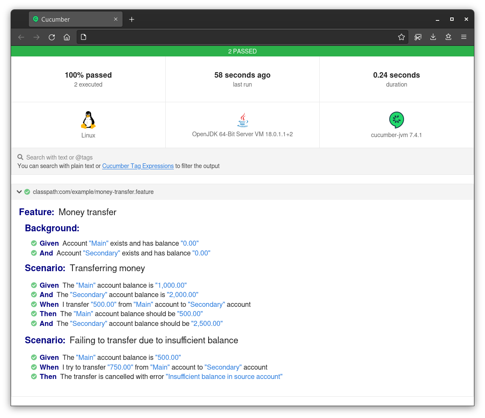

# POC: Spring Behavior Testing

It demonstrates how to run Behavior-Driven tests against a REST API using Cucumber.

The goal is to develop a Web service that exposes resources to manage a baking account. We should be able to create an
account, deposit money and transfer money to another account. The account must have a name and every input from clients
should be validated. These requirements should be specified using Gherkin
syntax and executed by Cucumber and JUnit with code coverage collected by JaCoCo.

The application is based on Spring Boot (MVC, JPA, Jakarta Validation), persists data in a Postgres database with
migrations managed by
Flyway. Edge cases are testing using JUnit and TestContainers and no manual configuration is required to run them.

## How to run

| Description | Command          |
|:------------|:-----------------|
| Run tests   | `./gradlew test` |

## Preview

Software specification:

```gherkin
Feature: Money transfer

  Background:
    Given Account "Main" exists and has balance "0.00"
    And Account "Secondary" exists and has balance "0.00"

  Scenario: Transferring money
    Given The "Main" account balance is "1,000.00"
    And The "Secondary" account balance is "2,000.00"
    When I transfer "500.00" from "Main" account to "Secondary" account
    Then The "Main" account balance should be "500.00"
    And The "Secondary" account balance should be "2,500.00"

  Scenario: Failing to transfer due to insufficient balance
    Given The "Main" account balance is "500.00"
    When I try to transfer "750.00" from "Main" account to "Secondary" account
    Then The transfer is cancelled with error "Insufficient balance in source account"
```

Test report generated in HTML:

